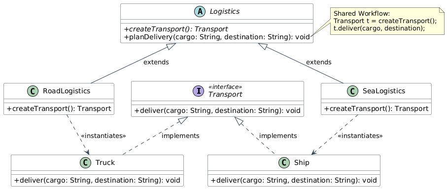
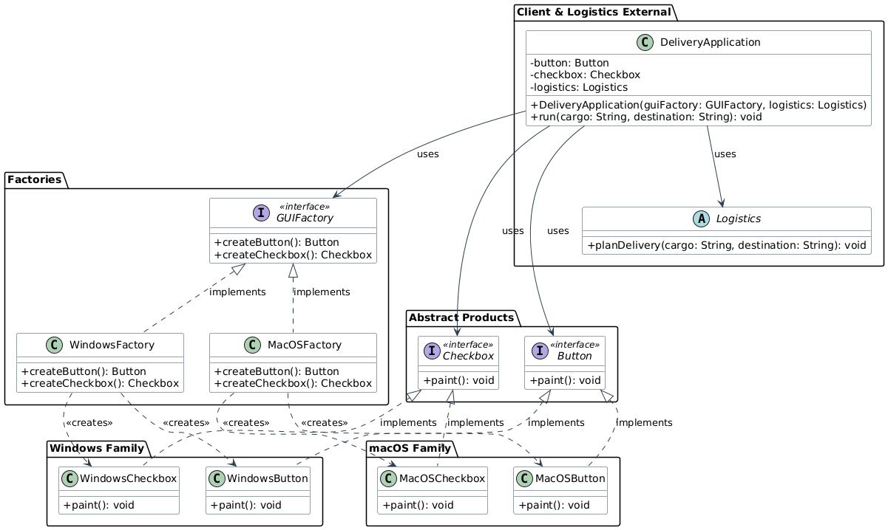

# Delivery Application - Assignment 2

## Project Purpose
This project is a console-based Java application demonstrating two fundamental creational design patterns:
1. **Factory Method**: Decouples logistics planning from concrete vehicle instantiation, creating `Truck` or `Ship` objects dynamically based on delivery mode.
2. **Abstract Factory**: Decouples user interface rendering from underlying platforms, instantiating families of related GUI components (`Button`, `Checkbox`) for Windows or macOS without specifying concrete classes.

---

## Prerequisites
* **Java Development Kit (JDK)**: Version 17 or higher.
* **Build System**: Standard Java Compiler (`javac`).

---

## Package Structure
```text
src/
├── abstractfactory/
│   ├── Button.java
│   ├── Checkbox.java
│   ├── GUIFactory.java
│   ├── MacOSButton.java
│   ├── MacOSCheckbox.java
│   ├── MacOSFactory.java
│   ├── WindowsButton.java
│   ├── WindowsCheckbox.java
│   └── WindowsFactory.java
├── delivery/
│   ├── DeliveryApp.java
│   └── Main.java
└── factorymethod/
    ├── Logistics.java
    ├── RoadLogistics.java
    ├── SeaLogistics.java
    ├── Ship.java
    ├── Transport.java
    └── Truck.java
```

---

## Build and Run Instructions

### 1. Compilation
Navigate to the root directory of the repository and compile all `.java` files:
```bash
javac -d bin src/delivery/*.java src/delivery/factorymethod/*.java src/delivery/abstractfactory/*.java
```

### 2. Execution
Run the compiled application using:
```bash
java -cp bin delivery.Main
```

---

## Supported Input Values

The application prompts for two inputs in the console:

| Parameter | Case-Insensitive Supported Values | Description |
| :--- | :--- | :--- |
| **Delivery mode** | `ROAD`, `SEA` | Selects transport vehicle (`Truck` for land, `Ship` for sea). |
| **UI platform** | `WINDOWS`, `MACOS` | Selects platform-specific UI component styling. |

*Any unsupported inputs will result in an error message and a clean system shutdown.*

---

## Sample Run

### Input:
```text
Delivery mode (ROAD / SEA): ROAD
UI platform (WINDOWS / MACOS): MACOS
```

### Output:
```text
Rendering macOS Button
Rendering macOS Checkbox
Truck delivers laboratory equipment to Aktau warehouse
```

---

## UML Diagrams

 — Factory Method Pattern Diagram
 — Abstract Factory Pattern Diagram

---

## Commit History

### 1. Base Transport Interface
* **Commit Message:** `feat(factorymethod): add Transport interface`
* **Files:** `src/delivery/factorymethod/Transport.java`
* **Description:** Define the contract for delivery vehicles with `deliver(cargo, destination)`.

---

### 2. Concrete Transport Implementations
* **Commit Message:** `feat(factorymethod): implement Truck and Ship classes`
* **Files:** `src/delivery/factorymethod/Truck.java`, `src/delivery/factorymethod/Ship.java`
* **Description:** Add concrete vehicle implementations for land (`Truck`) and sea (`Ship`) transport.

---

### 3. Abstract Logistics Creator
* **Commit Message:** `feat(factorymethod): add base Logistics abstract class`
* **Files:** `src/delivery/factorymethod/Logistics.java`
* **Description:** Add the abstract `Logistics` class declaring `createTransport()` and core `planDelivery()` workflow.

---

### 4. Concrete Logistics Implementations
* **Commit Message:** `feat(factorymethod): implement RoadLogistics and SeaLogistics`
* **Files:** `src/delivery/factorymethod/RoadLogistics.java`, `src/delivery/factorymethod/SeaLogistics.java`
* **Description:** Implement `RoadLogistics` and `SeaLogistics` factory creators.

---

### 5. Abstract Factory UI Abstractions
* **Commit Message:** `feat(abstractfactory): add GUI component interfaces and GUIFactory`
* **Files:** `src/delivery/abstractfactory/Button.java`, `src/delivery/abstractfactory/Checkbox.java`, `src/delivery/abstractfactory/GUIFactory.java`
* **Description:** Define `Button` and `Checkbox` product interfaces along with the `GUIFactory` interface.

---

### 6. Platform Specific UI Components
* **Commit Message:** `feat(abstractfactory): implement Windows and macOS UI elements`
* **Files:** `src/delivery/abstractfactory/WindowsButton.java`, `src/delivery/abstractfactory/WindowsCheckbox.java`, `src/delivery/abstractfactory/MacOSButton.java`, `src/delivery/abstractfactory/MacOSCheckbox.java`
* **Description:** Implement OS-specific buttons and checkboxes for Windows and macOS platforms.

---

### 7. Platform Specific Concrete Factories
* **Commit Message:** `feat(abstractfactory): implement WindowsFactory and MacOSFactory`
* **Files:** `src/delivery/abstractfactory/WindowsFactory.java`, `src/delivery/abstractfactory/MacOSFactory.java`
* **Description:** Add `WindowsFactory` and `MacOSFactory` to instantiate corresponding platform UI controls.

---

### 8. Application Client Orchestrator
* **Commit Message:** `feat(delivery): add DeliveryApp client class`
* **Files:** `src/delivery/DeliveryApp.java`
* **Description:** Create `DeliveryApp` integrating Abstract Factory and Factory Method via dependency injection.

---

### 9. Application Entry Point & Input Validation
* **Commit Message:** `feat(delivery): add Main class with console options`
* **Files:** `src/delivery/Main.java`
* **Description:** Add `Main` class to process runtime user selections for delivery mode and UI platform with proper fallback handling.
